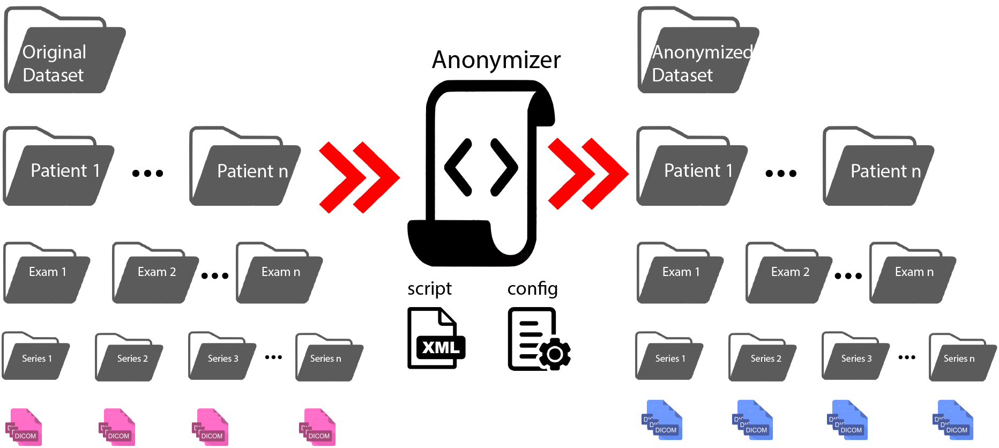
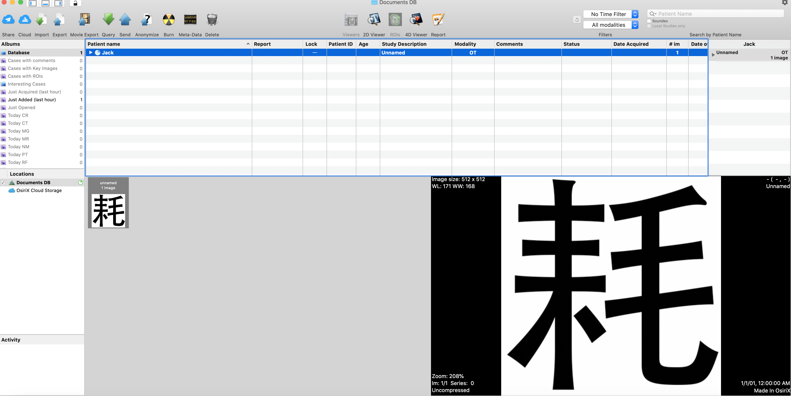
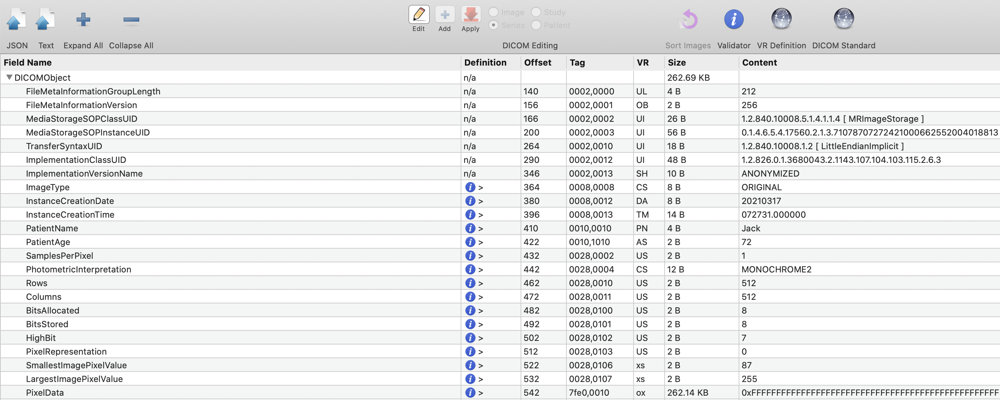
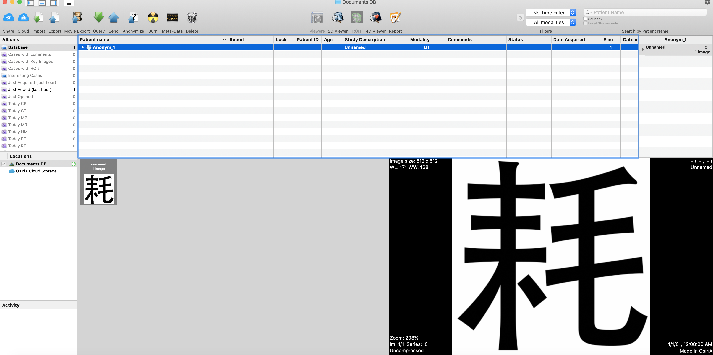
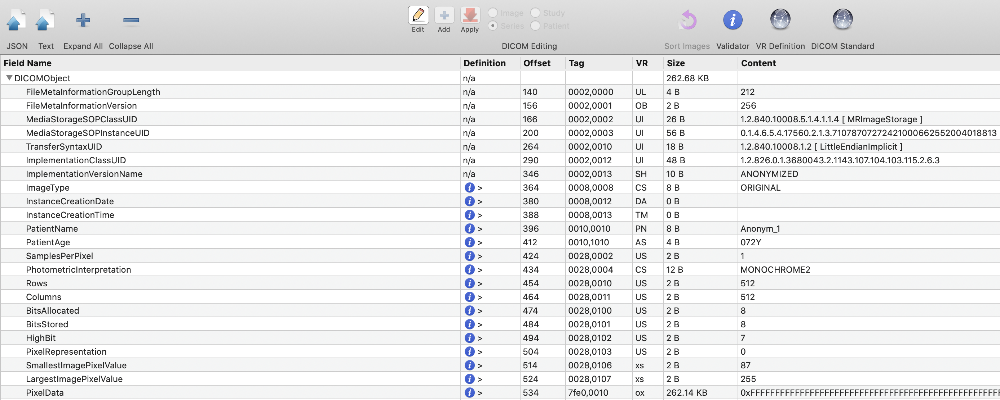

# Dicom Anonymizer
Medical image data is often stored in [DICOM](https://en.wikipedia.org/wiki/DICOM), which incorporates various modalities
of images (such as CT, MRI) as well as tags. Since some tags (such as Patient Name) contain PHI, these information should
be removed before the data can be released publicly. This python code utilizes [pydicom](https://pydicom.github.io/) to 
load/modify/save dicom files and can be used to anonymize a dicom dataset organized in *dataset/patient/exam/series/dicom* 
hierarchy. This code is used to anonymize the Duke Abdominal Dataset published in the following paper: 
```
Z. Zhu et al., "3D Pyramid Pooling Network for Abdominal MRI Series Classification," 
in IEEE Transactions on Pattern Analysis and Machine Intelligence, doi: 10.1109/TPAMI.2020.3033990.
```
[[link]](https://ieeexplore.ieee.org/abstract/document/9242262) [[bibtex]](#bibtex)

Please cite this paper if you find this code useful. For those who would like to use the [DicomAnonymizer](https://mircwiki.rsna.org/index.php?title=CTP-The_RSNA_Clinical_Trial_Processor#DicomAnonymizer) module in 
[RSNA MIRC Clinical Trials Processor (CTP)](https://mircwiki.rsna.org/index.php?title=Main_Page),an example can be found [here](https://github.com/ajex1988/mirc_ctp_dicom_anonymizer). 
## Dependencies
Dicom Anonymizer depends on the following libraries:
1. Pydicom
2. tqdm

## Overview

## Demo
We created a toy dataset in *dataset/mabaoguo* that contains two patients: **Jack** and **Pony**. **Jack**
has 2 exams while **Pony** has 1 exam. In each exam there are several series and in each series there are several
dicoms. After running the following script:
```
python demo.py
```
There will be a new folder called *mabaoguo_deidentified* created just under *dataset*, and the original dataset and the 
deidentified datset have the same structure. We added as many as possible comments in the code, please refer to the code for
more details. Both the original and the anonymized dicoms should be viewed in dicom viewers
such as Osirix.

Before running the script, the image and tags viewed in Osirix:



After the deidentification, the image and tags viewed in Osirix:



## Team
1. [Zhe Zhu](https://github.com/ajex1988)
2. [Maciej Mazurowski](https://sites.duke.edu/mazurowski/)
3. [Mustafa Bashir](https://radiology.duke.edu/faculty/member/mustafa-r-bashir/)
4. Brandon Konkel

Special thanks to Brandon Konkel for testing the code. Please contact Zhe Zhu(ajex1988@gmail.com) if you have any question
about this code.
### bibtex
```
@ARTICLE{9242262,
  author={Z. {Zhu} and A. {Mittendorf} and E. {Shropshire} and B. {Allen} and C. {Miller} and M. R. {Bashir} and M. A. {Mazurowski}},
  journal={IEEE Transactions on Pattern Analysis and Machine Intelligence}, 
  title={3D Pyramid Pooling Network for Abdominal MRI Series Classification}, 
  year={2020},
  volume={},
  number={},
  pages={1-1},
  doi={10.1109/TPAMI.2020.3033990}}
```
